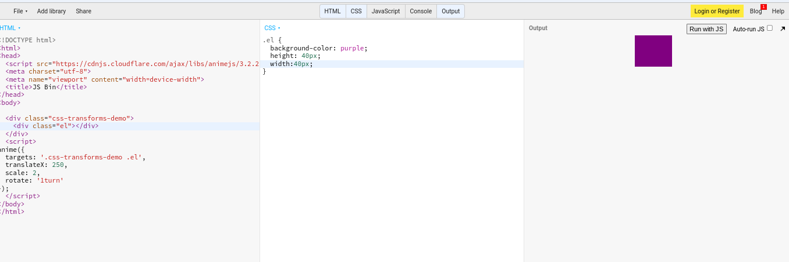
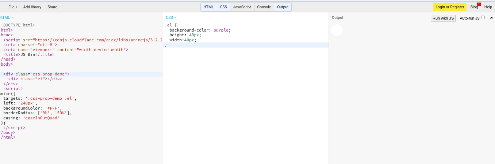

# Tool Learning Log

## Tool: **AnimeJs**

## Project: **X**

---

### 09/30/2024:
* Many types of animation code and specific targets such as properties, values, and many more.
* What I did to learn about my tool was reading the animejs website for information of those animation codes
* I tried to test it out on JsBin but the code did not work and I tried to put the script in and it still didnt work
So all I did for this was to learn about the code and try to think of the connection with this tool to my freedom project and how I would use it.
* Next time I will ask for help and try to start trying out the code.

### 10/27/24:
* What I did was I tried tinkering my tool in my IDE because it dodnt work in jsbin
* I tested out some of those codes in the animejs website to get a better understanding of the codes
* I change the codes up a little to make it my own and see if it works and it did.
* I also watched videos on my tool to help me out as well.

### 10/28/24:
* What I did was that I coded some of the examples and made it on my own adding codes into my css to try to match it to my game.
* [This code makes the shape translate right 270](image-1.png)
* I watched a youtube where it can help me form shapes however I like such as morphing a shape to a shape that I wanted it to be
    * [Youtube video on how to morph](https://www.youtube.com/watch?v=mAKYW_1f-dw&t=482s)
* I also watch a video for the more basic level of my tool so I can have a better understanding on when or how to use my divs to make my animation show up.
    * [Video on animjs basics](https://www.youtube.com/watch?v=uRDLFXxihgc)

### 11/07/24:
* What I did was I tried coding more examples from [animejs](https://animejs.com/documentation/#cssSelector) in jsbin to see how I can connect this tool with my freedom project
* I've been testing the animation css transform because it has a small connection to what I want to make.
* , this would animate the square to transform larger
* I also been doing the animation css property where the shape changes to another shape
* , this would change the shape of a square to a circle

### X/X/XX:
* Text

### X/X/XX:
* Text

### X/X/XX:
* Text

### X/X/XX:
* Text

### X/X/XX:
* Text

<!--
* Links you used today (websites, videos, etc)
* Things you tried, progress you made, etc
* Challenges, a-ha moments, etc
* Questions you still have
* What you're going to try next
-->
