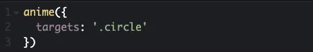

# Tool Learning Log

## Tool: **AnimeJs**

## Project: **X**

---

### 09/30/2024:
* Many types of animation code and specific targets such as properties, values, and many more.
* What I did to learn about my tool was reading the animejs website for information of those animation codes
* I tried to test it out on JsBin but the code did not work and I tried to put the script in and it still didnt work
So all I did for this was to learn about the code and try to think of the connection with this tool to my freedom project and how I would use it.
* Next time I will ask for help and try to start trying out the code.

### 10/27/24:
* What I did was I tried tinkering my tool in my IDE because it dodnt work in jsbin
* I tested out some of those codes in the animejs website to get a better understanding of the codes
* I change the codes up a little to make it my own and see if it works and it did.
* I also watched videos on my tool to help me out as well.

### 10/28/24:
* What I did was that I coded some of the examples and made it on my own adding codes into my css to try to match it to my game.
* [This code makes the shape translate right 270](image-1.png)
* I watched a youtube where it can help me form shapes however I like such as morphing a shape to a shape that I wanted it to be
    * [Youtube video on how to morph](https://www.youtube.com/watch?v=mAKYW_1f-dw&t=482s)
* I also watch a video for the more basic level of my tool so I can have a better understanding on when or how to use my divs to make my animation show up.
    * [Video on animjs basics](https://www.youtube.com/watch?v=uRDLFXxihgc)

### 12/4/24:
* Text
What I learned about my tool is that the animation needed its own css and hyml setup such as

so that my animation of the the circle can show in my server when i code the animation down

That would give me the circle and what im trying to target my animation too

so if i add the translation my circle would translate right 250

I also tried adding multiple circles (3) by adding more to my html and css so the circle would be in a row because of the margins and have a delay

so what that does is that it gives the circles a delay so they all dont go at the same time
I tried adding more to it by having a start time on when the circles to start moving such as adding

this take the circles a little longer to being their animation

In this whole week I was learning more about animation and how to put the animation within one line of code and figuring out how the animations will work and how it will contribute to my freedom project.

Next I will try to do some color changing mid animation to see how it works and learn more about animejs.

### 12/27/24:
I learned how to do timeline using animejs where I can add animations to the timeline, and it will play back to back based on their order.

in the circle element it will move to the right, then down and scale up.

I also tried using the will-change property where the will-change property elements will be animated. 

Next I learned how to direction, direction property can reverse animations. The 3 choices are 'normal', 'reverse', and 'alternate'.

Next I want to try more complex animations with animejs so I can contribute my tool to the game.

### X/X/XX:
* Text

### X/X/XX:
* Text

### X/X/XX:
* Text

<!--
* Links you used today (websites, videos, etc)
* Things you tried, progress you made, etc
* Challenges, a-ha moments, etc
* Questions you still have
* What you're going to try next
-->
